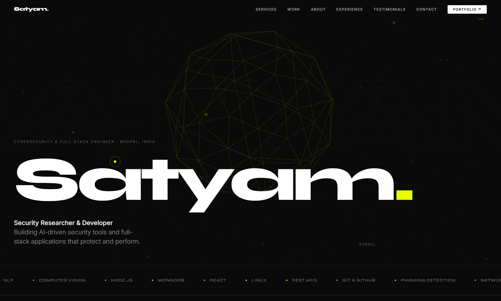

# Satyam Raghuvanshi - Modern Portfolio 🚀

A sleek, premium, and highly interactive personal portfolio website built with **React**, **Vite**, **Framer Motion**, and **Three.js**. Designed natively with a high-tech cybersecurity aesthetic, featuring an embedded cinematic 3D scrolling experience and dynamic GitHub integration.



## ✨ Features

- **Immersive 3D Background**: A fully responsive, interactive Three.js icosahedron and particle system that follows both cursor movement and scroll position across the entire page.
- **Dynamic GitHub Fetching**: Automatically pulls the top public repositories from GitHub (`@raghuvanshi-sec`), filters specific configurations, and maps them to custom custom-generated UI project cards.
- **Scroll Animations**: Smooth, high-performance entrance animations, stagger effects, and infinite marquees powered by `framer-motion`.
- **Custom Mouse Cursor**: A tailored, interactive cursor that snaps and scales dynamically with hoverable elements.
- **Premium Styling**: A cohesive "hacker-chic" dark theme with neon yellow accents (`#e8ff00`), glassmorphism overlays, and modern typography (`Syne` and `Inter`).
- **Fully Responsive**: Architectured with a mobile-first CSS grid and flexbox approach to look stunning on any device size.

## 🛠️ Tech Stack

- **Framework**: [React 18](https://react.dev/)
- **Build Tool**: [Vite](https://vitejs.dev/)
- **Styling**: Vanilla CSS3 (Custom Properties, Flexbox, Grid)
- **Animations**: [Framer Motion](https://www.framer.com/motion/)
- **3D Graphics**: [Three.js](https://threejs.org/)
- **API Integration**: GitHub REST API

## 🚀 Quick Start

To get a local copy up and running, follow these simple steps.

### Prerequisites
Make sure you have Node.js and npm installed on your machine.
* npm
  ```sh
  npm install npm@latest -g
  ```

### Installation

1. Clone the repository
   ```sh
   git clone https://github.com/raghuvanshi-sec/Modern-Portfolio.git
   ```
2. Navigate to the project directory
   ```sh
   cd Modern-Portfolio
   ```
3. Install NPM packages
   ```sh
   npm install
   ```
4. Start the development server
   ```sh
   npm run dev
   ```

## 📂 Project Structure

```text
├── public/                 # Static assets (Favicon, generated project images, profile photo)
├── src/
│   ├── components/         # Modular React components 
│   │   ├── About.jsx       # Biography and Stats 
│   │   ├── Background3D.jsx# Global Three.js canvas layer
│   │   ├── Contact.jsx     # Contact form & social links
│   │   ├── CustomCursor.jsx# Interactive mouse logic
│   │   ├── Experience.jsx  # Career timeline & Education
│   │   ├── Footer.jsx      # Footer section
│   │   ├── Hero.jsx        # Landing text and title
│   │   ├── Loader.jsx      # Initial startup animation
│   │   ├── Marquee.jsx     # Scrolling skills ticker
│   │   ├── Navbar.jsx      # Sticky navigation header
│   │   ├── Services.jsx    # Core capabilities grid
│   │   ├── Testimonials.jsx# Infinite feedback loop
│   │   └── Work.jsx        # Dynamic GitHub Projects fetching
│   ├── App.jsx             # Main application orchestrator
│   ├── index.css           # Global stylesheets and CSS variables
│   └── main.jsx            # React mounting point
├── index.html              # HTML entry point
├── package.json            # Project dependencies and scripts
└── vite.config.js          # Vite configuration
```

## 🤝 Contributing
Contributions, issues, and feature requests are welcome! Feel free to check the [issues page](https://github.com/raghuvanshi-sec/Modern-Portfolio/issues).

## 📝 License
Distributed under the MIT License. See `LICENSE` for more information.

---
*Designed & Engineered by Satyam Raghuvanshi.*
